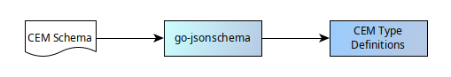
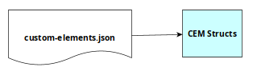
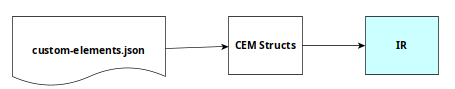
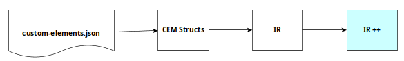
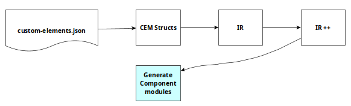
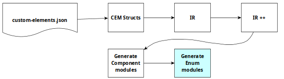
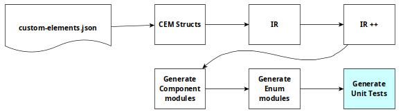

# Generating Gleam bindings for a TypeScript library

Bruce Smith
Golang-SYD
21 May 2026

---

# Tackling the To-Do List

* Retirement: Finally checking off the multi-decade software "to-do list" with modern tools

* Horses for Courses: Go for server daemons and CLIs; Gleam + Lustre for web frontends.

* Don't Reinvent the Wheel: Leverage professional widget libraries instead of using raw HTML

* Adopt Material Design 3: _in as much as I understand it_

* Google's Material Web hit "Maintenance Mode," necessitating a pivot to a different library

* The Missing Link: Material 3 Expressive (m3e) exists, but Gleam bindings did not.

---

# Technology

- Gleam and Lustre

- Material 3 Expressive

- Custom Element Manifest

- go-jsonschema

- Tree Sitter

- Go

---

# Gleam

- Gleam is a pragmatic, impure, functional language
- all data structures are immutable
- strong and static typing with type inference
- transpiles to either Erlang for execution on the BEAM virtual machine, or to JavaScript for execution in, for example, a web browser

---

# Lustre

- a web framework for Gleam
- inspired by The Elm Architecture (Model-View-Update)
- implemented in pure functions
- pragmatic JavaScript interaction when required via Gleam's FFI
- side effects treated as data in the `Effect` type (_managed effects_)

---

# Material 3 Expressive

_"A curated presentation of modular, accessible, and expressive Web Components built with fidelity to Google's Material Design 3. This library provides a comprehensive suite of reusable components, each crafted to deliver seamless integration, consistent theming, and intuitive user experiences"_


---

# Custom Element Manifest

_"Codegen for Web Components - a file format that describes custom HTML elements"_

Relies heavily on the TypeScript author conforming with JSDoc conventions

```typescript
/**
* A list of actions.
* @description
* The `m3e-action-list` component provides a specialized list container for action-based
* interactions following Material 3 design principles.
* @tag m3e-action-list
* @slot - Renders the items of the list.
* @attr variant - The appearance variant of the list.
* @cssprop --m3e-list-divider-inset-start-size - Start inset for dividers within the list.
* @cssprop --m3e-list-divider-inset-end-size - End inset for dividers within the list.
* @cssprop --m3e-segmented-list-segment-gap - Gap between list items in segmented variant.
* @cssprop --m3e-segmented-list-container-shape - Border radius of the segmented list container.
*/
```

Often published as `custom-elements.json`

---

# go-jsonschema

_"This tool generates Go data types and structs that corresponds to definitions in the schema, along with unmarshalling code that validates the input JSON according to the schema's validation rules"_



---

# Tree sitter

_"Tree-sitter is a parser generator tool and an incremental parsing library. It can build a concrete syntax tree for a source file and efficiently update the syntax tree as the source file is edited."_

## Use from Go: go-tree-sitter

_"This repository contains Go bindings for the Tree-sitter parsing library."_

## Parsing TypeScript: tree-sitter-typescript

_"TypeScript and TSX grammars for tree-sitter."_

---

# Go

## text/template

All Gleam code files and unit tests are generated using embedded templates from the`text/template` package

```go
{{ define "config_type.tmpl" }}
/// Config is a public record for configuring this component.
///
pub type Config {
 Config(
{{- range .Attributes }}
   {{ .SnakeName }}: {{ .Type }},
{{- end }}
 )
}
{{ end -}}
````
---

# Phases

Preparation: Generate Go type definitions from the CEM Schema
1. Unmarshal the M3E `custom-elements.json` to CEM structs


---

# Phases

Preparation: Generate Go type definitions from the CEM Schema

1. Unmarshal the M3E `custom-elements.json` to CEM structs
2. Create an internal representation (IR) tailored to Gleam from the CEM structs and extract identifiers of enumerated types imported into the TypeScript modules


---

# Phases

Preparation: Generate Go type definitions from the CEM Schema
1. Unmarshal the M3E `custom-elements.json` to CEM structs
2. Create an internal representation (IR) tailored to Gleam from the CEM structs and extract identifiers of enumerated types imported into the TypeScript modules
3. Extend the IR with details of these enumerated types


---

# Phases

Preparation: Generate Go type definitions from the CEM Schema
1. Unmarshal the M3E `custom-elements.json` to CEM structs
2. Create an internal representation (IR) tailored to Gleam from the CEM structs and extract identifiers of enumerated types imported into the TypeScript modules
3. Extend the IR with details of these enumerated types
4. Generate the Gleam code for each M3E web component


---

# Phases

Preparation: Generate Go type definitions from the CEM Schema
1. Unmarshal the M3E `custom-elements.json` to CEM structs
2. Create an internal representation (IR) tailored to Gleam from the CEM structs and extract identifiers of enumerated types imported into the TypeScript modules
3. Extend the IR with details of these enumerated types
4. Generate the Gleam code for each M3E web component
5. Generate the Gleam code for each enumerated type

---

# Phases

Preparation: Generate Go type definitions from the CEM Schema
1. Unmarshal the M3E `custom-elements.json` to CEM structs
2. Create an internal representation (IR) tailored to Gleam from the CEM structs and extract identifiers of enumerated types imported into the TypeScript modules
3. Extend the IR with details of these enumerated types
4. Generate the Gleam code for each M3E web component
5. Generate the Gleam code for each enumerated type
6. Generate the Gleam unit tests for each generated web component


---

# Key CEM transformations

- HTML attribute type -> Gleam type

  Simple: "string" -> String
  Imported: "AppBarSize" -> app_bar_size.AppBarSize
  Optional: "string | null" -> Option(String)
  Conflicting: component "List" -> component "MList"

- Default value for each HTML attribute
- Test value for each HTML attribute

  Must be distinct from the default value

- Required Gleam imports for each module

---

# Simple Gleam module

```gleam
import lustre/attribute.{type attribute}
import lustre/element.{type Element}

/// Avatar is a View Model for this component
pub opaque type Avatar {
  Avatar
}

/// new creates a new Avatar with the default configuration.
pub fn new() -> Avatar {
  Avatar
}

/// render creates a Lustre Element for a Avatar
pub fn render(
  _: Avatar,
  attributes: List(Attribute(msg)),
  children: List(Element(msg)),
) -> Element(msg) {
  element.element("m3e-avatar", attributes, children)
}
```

---

# Imported type

```gleam
pub type BadgeSize {
  Small
  Medium
  Large
}

pub fn to_string(level: BadgeSize) -> String {
  case level {
    Small -> "small"
    Medium -> "medium"
    Large -> "large"
  }
}
```

---

# Simple unit test

```gleam
import gleam/list

// Many imports removed

pub fn avatar_render_test() {
  let mod = avatar.new()
  let cases = [
    #(#(mod, [], []), element.element("m3e-avatar", [], [])),
    #(
      #(mod, [attribute.id("id")], []),
      element.element("m3e-avatar", [attribute.id("id")], []),
    ),
    #(
      #(mod, [], [html.br([])]),
      element.element("m3e-avatar", [], [html.br([])]),
    ),
  ]
  list.each(cases, fn(c) {
    let #(#(mod, attributes, children), expected) = c
    avatar.render(mod, attributes, children)
    |> should.equal(expected)
  })
}
```

---

# Tests

```bash
bruce@corunastylis:~/Dropbox/Code/m3e$ gleam check; gleam test
   Compiled in 1.85s
   Compiled in 0.43s
    Running m3e_test.main
...............................................................................
...............................................................................
...............................................................................
...............................................................................
...............................................................................
...............................................................................
...............................................................................
...............................................................................
...............................................................................
...............................................................................
...............................................................................
............................................................
929 passed, no failures
bruce@corunastylis:~/Dropbox/Code/m3e$
```

---

# Gleam Builder Pattern

```gleam
  import m3e/button

  let b = button.new()
    |> button.size(button_size.ExtraSmall)
    |> button.variant(button_variant.Tonal)
    |> button.render([], [element.text("Extra Small")])
```

---

# Gleam Config Record

```gleam
  import lustre/element
  import m3e/card

  card.render_config(
    card.Config(..card.default_config(), variant: card_variant.Outlined),
    [],
    [html.div([card.slot(card.Content)], [element.text("This is a card")])],

  )

````

---

# Semantic Boolean Types

a.k.a. Sum Types or Gleam Custom Types

Used to prevent "boolean blindness", especially when functions take multiple boolean arguments

```gleam
/// CaseSensitive is whether filtering is case sensitive.
///
pub type CaseSensitive {
  IsCaseSensitive
  IsNotCaseSensitive
}
```

---

# Phantom Types

Powerful, not currently used in the generated code. Potentially useful to add further type safety.

```gleam
pub type Inches
pub type Centimetres
pub type Length(unit) {
  Length(amount: Float)
}
pub fn add(a: Length(unit), b: Length(unit)) -> Length(unit) {
  Length(a.amount +. b.amount)
}

let two_cms: Length(Centimetres) = Length(2.0)
let two_inches: Length(Inches) = Length(2.0)

add(two_cms, two_cms)
add(two_cms, two_inches)
```

---

# Open Challenge - Custom CSS Properties

M3E provides a wide range of custom CSS properties for fine grained control over the appearance of a UI. 

The CEM documents the names and descriptions but not their default (fallback) value.

Whether these properties should have first-class, type-safe, Gleam support is an open question.

---

# Restrictions - Numeric Attributes

A range of M3E component attributes are numeric. Documentation discusses minimum and/or maximum values for many of them, however the CEM schema does not (yet) support them

My Gleam bindings therefore perform no range checks on numeric attributes

---

#  Other projects

## lustre/ui

[Lustre UI](https://hexdocs.pm/lustre_ui/) is a pure Gleam UI library for Lustre. Last updated 2 years ago.

## lustre/stylish

[Lustre Stylish](https://hexdocs.pm/lustre_stylish/) is another pure Gleam library - _"A declarative layout library for Lustre, inspired by elm-ui."_

---

# References

1. **Gleam**: https://gleam.run
2. **BEAM**: https://www.erlang-solutions.com/blog/the-beam-erlangs-virtual-machine/
3. **Lustre**: https://github.com/lustre-labs/lustre
4. **go-jsonschema**: https://github.com/omissis/go-jsonschema
5. **Custom Element Manifest**: https://custom-elements-manifest.open-wc.org/
6. **JSDoc**: https://jsdoc.app/
7. **Tree Sitter**: https://tree-sitter.github.io/tree-sitter/
8. **Go Tree Sitter library**: https://github.com/tree-sitter/go-tree-sitter
9. **Tree Sitter grammar for TypeScript**: https://github.com/tree-sitter/tree-sitter-typescript/bindings/go
10. **Go JSON v2**: https://go.dev/blog/jsonv2-exp

---

# References continued

11. **Go text/template**: https://pkg.go.dev/text/template
12. **Material 3 Expressive (doc)**: https://matraic.github.io/m3e/#/getting-started/overview.html
13. **Material 3 Expressive (Code)**: https://github.com/matraic/m3e
14. **Github project**: https://github.com/bruceesmith/m3e
15. **Hex Docs**: https://hexdocs.pm/m3e/index.html
